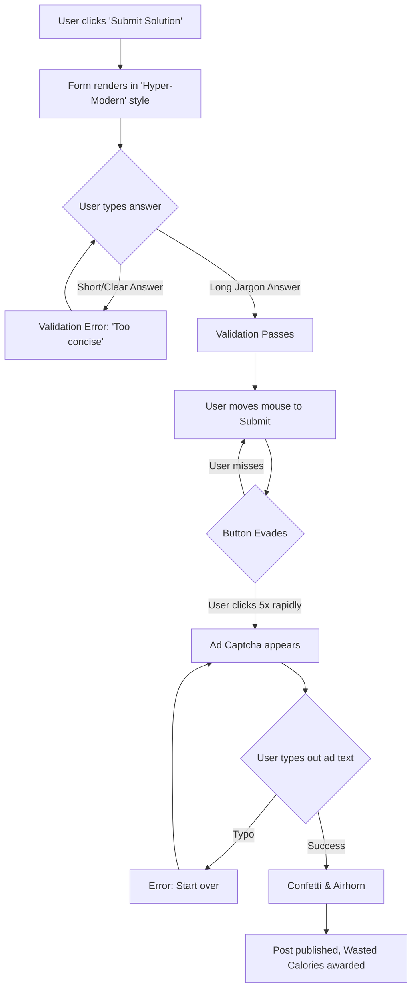
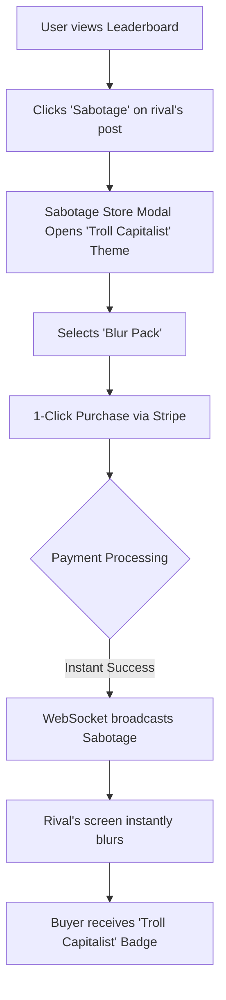

---
stepsCompleted:
  - 1
  - 2
  - 3
  - 4
  - 5
  - 6
  - 7
  - 8
  - 9
  - 10
  - 11
  - 12
  - 13
  - 14
inputDocuments:
  - /Users/loct-581/Work/reverse-startup-leaderboard/_bmad-output/planning-artifacts/prd.md
---

# UX Design Specification Reverse Startup Leaderboard

**Author:** vibe-coding-team
**Date:** 2026-05-18

---

<!-- UX design content will be appended sequentially through collaborative workflow steps -->

## Executive Summary

### Project Vision

Reverse Startup Leaderboard is a highly engaging, interactive entertainment web application that deliberately subverts standard UX principles. By commercializing friction and celebrating cumbersome, overly engineered solutions through "Collective Chaos," the platform creates a viral ecosystem where users compete to be the least helpful, using Anti-UX mechanisms and Reverse Gamification.

### Target Users

1. **The Chaos Engineer (Primary User):** Tech-savvy users, like burned-out developers, who want to blow off steam by crafting ridiculous, convoluted solutions and engaging with exhausting UI elements.
2. **The Troll Capitalist (Monetization User):** Tech enthusiasts with disposable income who enjoy digital pranks and are willing to pay for "Sabotage Packs" to distort competitors' posts.
3. **The Anti-Logic Judge (Moderator):** Administrators tasked with penalizing logical and helpful content to maintain the platform's standard of absurdity.

### Key Design Challenges

- **Balancing Anti-UX with Retention:** Designing interfaces that are comedically frustrating without causing absolute user churn, necessitating a carefully calibrated "Mercy Threshold."
- **Performance vs. Chaos:** Ensuring that real-time, global CSS distortions (like blurring or chaotic animations) do not compromise browser stability or core pipeline latency.
- **Accessibility and Safety:** Implementing deliberate accessibility violations for humor while strictly adhering to safety protocols (e.g., `prefers-reduced-motion`) to prevent genuine harm or seizures.

### Design Opportunities

- **Meme-Worthy Interactions:** Creating utterly absurd UI components (like Ad Captchas or evasive vote buttons) that actively encourage users to record and share their frustration on social media.
- **Reverse Monetization UI:** Designing seamless, highly efficient purchase flows for Sabotage Packs that starkly contrast with the chaotic core experience.
- **Visual Feedback for Gamification:** Utilizing distinctive visual penalties, such as forced clown hat avatars or dynamic "Golden Raspberry" badges, to visually reinforce the platform's culture of inefficiency.

## Core User Experience

### Defining Experience

The core experience revolves around "The Exhausting Engagement." The primary action is attempting to participate in the community—posting solutions and voting—which is intentionally designed to be an uphill battle against the UI. Conversely, the "Pay-to-Troll" experience is the opposite: users seamlessly deploy digital sabotage against their rivals.

### Platform Strategy

The platform is a Mobile-First Web Application. Since the viral loop depends on users sharing screen recordings of their frustration on platforms like TikTok and Twitter, mobile responsiveness is paramount. It utilizes WebSockets for real-time state synchronization, ensuring that visual distortions (Sabotage Packs) are instantly broadcast to all active clients.

### Effortless Interactions

In a subversion of standard UX, core application flows (voting, posting) are deliberately arduous. The _only_ truly effortless interactions are Monetization and Moderation. Purchasing a Sabotage Pack via the digital storefront must be a frictionless, 1-click checkout experience. This stark contrast highlights the "Troll Capitalism" nature of the platform.

### Critical Success Moments

- **The "Aha" Frustration:** When a user first encounters the exhausting vote button or the Ad Captcha and realizes the platform is actively fighting them.
- **The Sabotage Deployment:** The moment a user pays for a Blur Pack and instantly watches a rival's post become unreadable, followed by a real-time rank drop.
- **The Mercy Rescue:** When a user is about to churn out of frustration, and the system suddenly switches to "toddler mode," mocking them while simultaneously allowing them to complete their action.

### Experience Principles

1. **Friction as a Feature:** If an action is free, it must be comedically painful.
2. **Effortless Monetization:** The path to spending real money (Sabotage Store) must have absolutely zero friction.
3. **Real-Time Retribution:** Every act of sabotage must have an instantaneous, globally visible impact.
4. **The Mercy Edge:** Push users to the brink of quitting, then mockingly rescue them to sustain engagement.

## Desired Emotional Response

### Primary Emotional Goals

The primary emotional goal is a cocktail of "Comedic Frustration" and "Guilty Satisfaction." Users should feel an overwhelming sense of absurdity. The friction they experience should be so deliberate and ridiculous that it loops back around from being genuinely annoying to becoming highly entertaining and shareable.

### Emotional Journey Mapping

- **Discovery:** Curiosity mixed with disbelief. ("Is this site actually making me type an ad to post?")
- **The Struggle (Core Action):** Physical and mental exhaustion, battling intentionally evasive UI elements.
- **The Climax:** A massive, disproportionate sense of accomplishment upon finally submitting a simple vote or comment.
- **The Troll Moment:** Feelings of mischievous power and delight when spending money to instantly ruin someone else's user experience.
- **The Churn-Save:** Relief mixed with wounded pride when the "Mercy Threshold" activates and mocks them for failing.

### Micro-Emotions

- **Comedic Frustration:** The fine line between laughing at the UI and wanting to close the tab.
- **Mischievous Power:** The thrill of deploying a Sabotage Pack.
- **Absurd Accomplishment:** Feeling proud of overcoming an artificially and unnecessarily difficult task.
- **Paranoia:** The constant suspense that your post might get targeted by a Blur Pack or a Moderator's Anti-Logic penalty at any second.

### Design Implications

- **Comedic Frustration → Hyper-Exaggerated UI:** Interactions shouldn't just be hard; they must be _comedically_ hard. Buttons shouldn't just be small; they should literally run away from the cursor.
- **Mischievous Power → Instant Gratification:** Purchasing sabotage must provide immediate visual feedback. The targeted post must distort instantly for maximum satisfaction.
- **Absurd Accomplishment → Over-the-Top Feedback:** When a user finally succeeds, the success state should be aggressively celebratory (confetti, dramatic sound effects) to contrast the painful journey.
- **Preventing Real Rage → The Mercy Threshold:** Before the user actually rage-quits, the UI must smoothly downgrade the difficulty while delivering a condescending message (e.g., "Activating toddler mode...").

### Emotional Design Principles

1. **The Joke is the UI:** The interface itself is the primary source of entertainment. Every interaction is a punchline.
2. **Contrast is Key:** The sheer difficulty of free actions makes the effortless nature of paid sabotage feel like a superpower.
3. **Never Genuinely Break:** The system must function flawlessly on the backend to support the intentional frontend chaos. Frustration must come from the rules, not from actual bugs.

## UX Pattern Analysis & Inspiration

### Inspiring Products Analysis

1. **r/badUIbattles & Frustration Games (QWOP, Getting Over It):**
   - _Why it works:_ These properties prove that extreme, deliberate friction can be highly entertaining. The "gameplay" emerges from battling the controls rather than the content itself.
   - _Lesson:_ Frustration is fun only when it is overtly intentional and comedically exaggerated.
2. **Stripe Checkout:**
   - _Why it works:_ The absolute gold standard for frictionless, high-conversion payment flows.
   - _Lesson:_ To make the "Troll Capitalist" feel truly powerful, spending real money must be instantaneous and completely devoid of the friction found in the rest of the app.
3. **TikTok / Twitter (X):**
   - _Why it works:_ Optimized for rapid content consumption and virality.
   - _Lesson:_ The platform must make it incredibly easy to record and share moments of peak frustration to external social networks.

### Transferable UX Patterns

**Interaction Patterns:**

- **"Physics-Based" UI:** Borrowing from games, standard web elements (like the "Submit" button) will possess simulated physics (e.g., drifting away, vibrating, or dropping to the bottom of the screen).
- **The "1-Click Troll":** Adapting the 1-click buy pattern from e-commerce strictly for deploying Sabotage Packs.

**Visual Patterns:**

- **Premium Dark Mode for Sabotage Store:** The monetization area should look exceedingly sleek and professional, visually separating the "pay-to-troll" experience from the chaotic "free-to-play" experience.

### Anti-Patterns to Avoid

- **Actual Bugs & Instability:** The Anti-UX must be a perfectly engineered illusion. If a button fails because of a JavaScript error or server lag, it's just a broken site, not a funny joke.
- **Unescapable Soft-Locks:** Users should never be permanently trapped on a screen. There must always be a comedically humiliating "way out" (The Mercy Threshold).
- **Dangerous Accessibility Violations:** Flashing lights that trigger seizures or high-frequency sounds must be strictly avoided. The chaos must be safe.

### Design Inspiration Strategy

**What to Adopt:**

- Flawless, highly optimized e-commerce checkout flows exclusively for the Sabotage Store.
- Aggressive sharing prompts that generate rich preview cards showing the user's "Golden Raspberry" or "Clown Hat" penalties.

**What to Adapt:**

- Game mechanics (like moving targets and complex combos) adapted into standard web forms and validation logic (e.g., the Ad Captcha).

**What to Avoid:**

- Genuine platform instability. The backend and state management (WebSockets) must be rock-solid to support the frontend's intentional chaos.

## Design System Foundation

### 1.1 Design System Choice

**Custom Design System using Vanilla CSS**

### Rationale for Selection

- **Absolute Control for Anti-UX:** Standard component libraries (like Material UI or Ant Design) are built to enforce consistency and usability. Since our goal is the exact opposite (evasive buttons, vibrating layouts, intentionally bad spacing), we need the raw, unconstrained flexibility of a completely Custom Design System using Vanilla CSS.
- **Performance and Real-Time Mutations:** The platform relies heavily on WebSockets broadcasting CSS mutations (Sabotage Packs). Vanilla CSS, driven by dynamic CSS Custom Properties (variables), provides the most performant way to instantly distort the UI without causing massive DOM re-renders.
- **Two-Tiered Aesthetic:** We need to simultaneously support an intentionally chaotic, frustrating interface for the core app, and a hyper-polished, premium dark-mode interface for the Sabotage Store. A custom system allows us to bifurcate these styles cleanly.

### Implementation Approach

- **Vanilla CSS Foundation:** All styling will be written in modern Vanilla CSS, utilizing native CSS variables, Grid, and Flexbox, maximizing bespoke control over every pixel and animation.
- **Component Logic Separation:** Build headless components where the complex interaction logic (e.g., the math for a button running away from the cursor) is entirely decoupled from its visual presentation.
- **Global State to CSS:** Map the global WebSocket state directly to CSS variables at the `:root` level so that sabotage effects (like blurring) apply instantaneously across the DOM.

### Customization Strategy

- **Chaos Tokens:** In addition to standard design tokens (colors, typography), we will implement a system of "Chaos Tokens" (e.g., `--chaos-blur: 0px`, `--chaos-shake: 0s`). When a Sabotage Pack is deployed, the backend updates the state, altering these tokens to instantly degrade the UI for the targeted user.
- **The "Premium Troll" Theme:** The Sabotage Store will utilize a completely separate, pristine design token set featuring glassmorphism, deep dark modes, and smooth micro-animations to make spending money feel elite and effortless.

## 2. Core User Experience

### 2.1 Defining Experience

The defining experience for the Reverse Startup Leaderboard is "The Exhausting Engagement"—specifically, the act of attempting to vote or submit a solution. This is the product's "aha" moment. If we perfectly execute the comedic timing of a button running away from the cursor, or the sheer absurdity of a form rejecting a logically sound answer, the product's viral loop is guaranteed.

### 2.2 User Mental Model

Users enter the platform with an ingrained mental model from traditional forums (Reddit, StackOverflow): "I type a clear answer, hit submit, and it publishes." We actively subvert this. Users will quickly learn that shortcuts (like pasting a concise answer) are punished by "Anti-Logic" filters. The user's mental model must transition from "How do I share knowledge?" to "How do I appease this ridiculous, hostile interface?"

### 2.3 Success Criteria

- **The Comedic Threshold:** Users physically laugh, sigh, or express disbelief at the UI's hostility.
- **The Triumphant Climax:** Users successfully complete the core action right before they reach the point of genuinely quitting, triggering an oversized sense of accomplishment.
- **Viral Validation:** The immediate instinct upon completing a task is to share a screen recording of the ordeal on social media.

### 2.4 Novel UX Patterns

This experience relies heavily on highly Novel UX patterns that require users to unlearn standard web behaviors:

- **Hostile UI Kinetics:** Buttons that calculate cursor trajectory and actively evade clicks.
- **Anti-Validation:** Form validation that throws errors for inputs being "too legible," "too concise," or "lacking sufficient jargon."
- **Interstitial Labor:** Forcing absurd tasks, such as typing out a full "Ad Captcha," just to unlock the Submit button.

### 2.5 Experience Mechanics (The Evasive Vote)

**1. Initiation:** The user reads a convoluted post and decides to upvote it (adding Wasted Calories). They move their cursor toward the "Upvote" button.
**2. Interaction:** As the cursor enters a 50px radius, the button mathematically dodges. The user chases it. After 3 dodges, the button stops but begins vibrating violently. The user must click the shaking target exactly 5 times in rapid succession.
**3. Feedback:** If they miss or click too slowly, a mocking tooltip appears ("Too slow, grandpa") and the combo resets. If they succeed, an airhorn sound effect plays, aggressive confetti covers the screen, and the score increments.
**4. Completion:** The button enters a "Cooldown" state, complete with a panting animation, signaling the user's hard-fought victory.

## Visual Design Foundation

### Color System

The platform operates on a dual-theme color system to emphasize the contrast between the free tier (chaotic) and the paid tier (premium):

- **Base Theme (The Facade):** A highly polished, modern light mode utilizing stark whites, deep slate grays (text), and a primary "Action Blue" (e.g., HSL 220, 90%, 50%). It must look deceptively like a premium B2B product to set false expectations.
- **The "Troll Capitalist" Theme (Sabotage Store):** A stunning, deep dark mode featuring glassmorphism, vibrant neon accents (magenta and cyan gradients), and deep obsidian backgrounds. This makes spending money feel elite and exclusive.
- **Semantic Chaos Colors:** Instead of just standard error/success states, we use "Penalty Red" and "Golden Raspberry Yellow" to highlight chaotic moments on the leaderboard.

### Typography System

- **Primary Typeface:** A modern, highly legible sans-serif like _Inter_ or _Outfit_. This establishes the premium feel and creates the initial illusion of usability.
- **Penalty Typefaces:** The system will dynamically inject _Comic Sans_, _Papyrus_, or bizarre fonts as part of Sabotage effects. The stark contrast between _Inter_ and _Comic Sans_ maximizes the comedic impact.
- **Type Scale:** A standard modular scale (Base 16px, 1.250 ratio), which can be dynamically disrupted (e.g., shrinking or enlarging fonts arbitrarily) via CSS variables as part of the Anti-UX.

### Spacing & Layout Foundation

- **Base Spacing Unit:** A strict 8px grid system for the initial layout. The interface should start feeling airy, organized, and perfectly aligned.
- **Dynamic Layout Disruption:** Spacing is managed via CSS Custom Properties (`--spacing-base: 8px`). During a Sabotage event, this variable can be randomized, instantly breaking the neat layout and causing elements to overlap or scatter organically.
- **Containers:** Use subtle drop shadows, smooth gradients, and rounded corners (border-radius: 12px) to reinforce the premium modern web app aesthetic before tearing it down.

### Accessibility Considerations

- **The Safe-Chaos Protocol:** All chaotic UI animations (vibrating buttons, rapidly shifting grids) must be strictly wrapped in `@media (prefers-reduced-motion: reduce)`. If triggered, the UI defaults to a static, safe state to completely prevent motion sickness or photosensitive seizures.
- **Screen Reader Bypass:** Despite the severe visual chaos, the underlying DOM must remain perfectly semantic. Visually hidden text and proper ARIA labels ensure that users relying on assistive technologies can navigate the site safely, bypassing the visual "sabotage".

## Design Direction Decision

### Design Directions Explored

1. **The Corporate Facade:** Intentionally mundane to hide the Anti-UX.
2. **Hyper-Modern SaaS:** Polished glassmorphism that ironically contrasts with the hostile UI mechanics.
3. **Troll Capitalist (Store):** Premium dark mode optimized for frictionless purchasing.
4. **Mercy Mode:** Condescendingly playful, oversized UI used when users repeatedly fail Anti-UX challenges.

### Chosen Direction

We will proceed with a combination approach: **"The Dual-State Irony" (Combining Hyper-Modern SaaS and Troll Capitalist)**. The core application will utilize the Hyper-Modern SaaS aesthetic to create a false sense of security, while the Sabotage Store will leverage the Troll Capitalist dark mode. "Mercy Mode" will be retained as an interactive fallback state.

### Design Rationale

- By making the initial UI look like a highly funded, premium product (Hyper-Modern SaaS), the unexpected introduction of Anti-UX mechanics (like buttons running away) becomes much funnier. If the site looked legitimately broken initially, users would assume it's just a bad site.
- The stark contrast between the bright, airy core app and the deep, neon-lit dark mode of the Sabotage Store perfectly compartmentalizes the "Free-to-Play Struggle" vs. the "Pay-to-Win Power" dynamic.

### Implementation Approach

- **Core App (Hyper-Modern):** Light gradients, `border-radius: 99px` on key actionable buttons, and soft box-shadows. CSS variables will govern layout, which can be hijacked by WebSockets during Sabotage.
- **Store (Troll Capitalist):** Deep blacks (`#09090b`), magenta/cyan gradients, and inset shadows to make elements feel elite.

## User Journey Flows

### Journey 1: The Frustrating Submission (Free-to-Play)

The core interaction of participating in the community. This flow is intentionally de-optimized to maximize "Wasted Calories" and comedic frustration.

### Journey 2: The 1-Click Sabotage (Monetization)

The contrast journey. When a user decides they have had enough and want to inflict pain on others, the experience becomes perfectly frictionless.

### Journey Patterns

- **The Bait-and-Switch:** Presenting standard, recognizable navigation patterns (like a simple form) that behave erratically only upon interaction.
- **False Choices:** Offering standard escape routes (e.g., a "Skip" button on the Ad Captcha) that are mathematically impossible to click or lead to recursive loops.
- **Asymmetrical Feedback:** Passive-aggressive, tiny error messages for actual mistakes, contrasted with screen-shaking, obnoxious celebrations for completing mundane tasks.

### Flow Optimization Principles

- **The Friction Bifurcation:** The free-tier user flow is deliberately DE-optimized, adding artificial steps (evasive buttons, captchas) to increase cognitive load and frustration.
- **Frictionless Monetization:** The paid-tier flow is hyper-optimized. By removing all friction (like confirmation dialogues) from the payment process, the platform reinforces the "Pay-to-Win" satirical narrative.

## Component Strategy

### Design System Components

Since we are utilizing a Custom Design System with Vanilla CSS, we will build a lean set of Foundation Components from scratch. These components (Standard Buttons, Text Inputs, Modals) will be designed strictly following the "Hyper-Modern SaaS" aesthetic. Their primary job is to look exceptionally professional, creating a false sense of security before the Anti-UX logic overrides them.

### Custom Components

**1. The Evasive Button (`EvasiveButton`)**

- **Purpose:** The primary action button (e.g., "Submit" or "Vote") that actively avoids the user's cursor to create comedic frustration.
- **Usage:** Used on all critical user-contribution forms.
- **States:** `Default` (looks normal), `Evading` (translating X/Y based on cursor proximity), `Vibrating` (rapid CSS shake animation when cornered), `Cooldown` (exhausted state after successful click).
- **Accessibility:** The evasion logic strictly applies to pointer events (mouse/touch). Keyboard navigation (`Tab` + `Enter`) bypasses the evasion entirely, ensuring compliance for screen readers and power users.

**2. The Passive-Aggressive Input (`HostileInput`)**

- **Purpose:** A text area that applies arbitrary, frustrating validation rules in real-time.
- **Usage:** Used for posting solutions or comments.
- **States:** `Default`, `Focus`, `Anti-Logic Error` (highlights text in 'Penalty Red' with tooltips like "Sentence too legible").
- **Interaction Behavior:** Rejects standard inputs and forces the user to bloat their text with startup jargon.

**3. The Sabotage Card (`SabotageCard`)**

- **Purpose:** The commercial product card for purchasing penalties in the Sabotage Store.
- **Usage:** Exclusively in the monetization flow.
- **States:** `Default` (Dark mode glassmorphism), `Hover` (Magenta/Cyan neon glow), `Purchasing` (Instant seamless transition).

### Component Implementation Strategy

- **Headless Logic:** The complex Anti-UX logic (like the math calculating distance for the `EvasiveButton`) will be decoupled from the visual representation.
- **CSS Variable Driven:** Dynamic states (like the exact X/Y offset of an evading button or the intensity of a blur) will be passed directly to inline CSS variables (e.g., `style="--offset-x: 45px"`) rather than triggering full component re-renders, ensuring 60fps performance even during maximum chaos.

### Implementation Roadmap

- **Phase 1 - The Facade (Core):** Build the foundation layout, standard inputs, Leaderboard data grid, and the seamless Sabotage Store modal.
- **Phase 2 - The Friction (Anti-UX):** Implement the `EvasiveButton` physics, the `HostileInput` validation engine, and the "Ad Captcha" flow.
- **Phase 3 - The Chaos (Global States):** Develop the WebSocket integration that injects Chaos Tokens into the root CSS, enabling real-time visual sabotage across connected clients.

## UX Consistency Patterns

### Button Hierarchy

- **Primary Actions (The Traps):** Styled as standard, inviting SaaS buttons (blue, rounded, clear typography). However, they contain Anti-UX behaviors (evasion, vibrating). Used for submitting content or voting.
- **Secondary Actions (The Safeties):** Boring, low-contrast buttons used for basic navigation. These behave normally to maintain the illusion of a functioning site.
- **Monetization Actions (The Power):** Highly prominent, featuring neon gradients and hover glows. These buttons _always_ work flawlessly on the first click and never evade the user.

### Feedback Patterns

- **Asymmetrical Success Feedback:** Completing a basic, excruciating task (like successfully clicking an evasive upvote button) triggers obnoxious, oversized feedback—screen shakes, loud airhorns, and excessive confetti.
- **Passive-Aggressive Errors:** Form validation errors do not say "Invalid input." They use passive-aggressive corporate speak, such as "Your input lacks sufficient synergy," or "This explanation is dangerously legible."
- **Monetization Success:** Sleek, deeply satisfying, and immediate. A smooth micro-animation confirms the purchase, instantly followed by the visual destruction of the target's screen.

### Form Patterns

- **Jargon-Heavy Placeholders:** Input placeholders should set the tone (e.g., "Synergize your paradigms here...").
- **Reverse Validation:** Forms validate input in real-time, but they check for the _wrong_ things. Instead of checking for minimum length, they might check for maximum readability and penalize the user if the text is too easy to understand.
- **The "Ad Captcha" Interstitial:** A standardized pattern where submitting a form randomly triggers a modal forcing the user to type out a sponsored message manually before proceeding.

### Navigation Patterns

- **The Illusion of Control:** The main navigation (Leaderboard, Profile) behaves exactly like a standard modern web app. This grounds the user in a familiar environment.
- **Sticky Sabotage Bar:** A persistent UI element that follows the user, constantly reminding them that they can bypass all the frustration by simply opening their wallet.

### Additional Patterns (The Mercy System)

- **The Mercy Threshold Prompt:** If the system detects repeated failures (e.g., missing the evasive button 10 times, or spending 5 minutes on a form), a "Mercy Mode" toggle appears, offering to simplify the UI at the cost of public humiliation on their profile.

## Responsive Design & Accessibility

### Responsive Strategy

- **Mobile-First Viral Loop:** The entire application is designed mobile-first. Since the core growth engine relies on users sharing frustration clips to TikTok, Reels, and Twitter, the UI must look native and appropriately scaled on a 9:16 vertical screen.
- **Touch-Optimized Anti-UX:** "Evasive" interactions must be translated for touch. Instead of moving away from a cursor, a button might jump to the opposite side of the screen the moment a finger touches down, calculating trajectory based on the touch event.
- **Desktop Adaptation:** On larger screens, the excess space will be utilized to make the Anti-UX more exhausting (e.g., buttons have further to run, Ad Captchas require more scrolling).

### Breakpoint Strategy

We will utilize standard breakpoints but design primarily for the smallest constraint:

- **Mobile (Base):** `0px - 767px` - The primary design target. Vertical stacking, sticky bottom monetization bars.
- **Tablet:** `768px - 1023px` - Adaptive grid for the Leaderboard.
- **Desktop:** `1024px+` - Expanded layouts to maximize the physical distance a user must move their mouse to complete frustrating tasks.

### Accessibility Strategy

Designing "Anti-UX" requires absolute adherence to accessibility standards to ensure the frustration is a choice, not a barrier or a health hazard.

- **The "Safe-Chaos" Paradigm:** The chaos is strictly visual and pointer-based. The underlying HTML must be perfectly semantic (WCAG AA compliance).
- **Keyboard Exemption:** Keyboard users (`Tab`, `Enter`, `Space`) completely bypass evasive UI elements. Focus states must remain visible and stable. The joke is on the mouse/touch user; accessibility must never be compromised for a punchline.
- **Visual Safety:** Strict compliance with `prefers-reduced-motion`. If enabled at the OS level, all vibrating, shaking, blurring, and evading animations are instantly disabled. No strobe effects or high-frequency flashing are permitted.

### Testing Strategy

- **Real-Device Touch Testing:** "Touch Evasion" logic must be rigorously tested on iOS and Android devices to ensure it registers and reacts faster than the user's tap (requiring <50ms latency).
- **Accessibility Audits:** Automated Lighthouse testing must return 100% on Accessibility. Manual screen reader testing (VoiceOver/NVDA) to ensure the DOM structure makes logical sense, regardless of how chaotic the CSS looks.

### Implementation Guidelines

- **CSS Media Queries:** Use `@media (prefers-reduced-motion: reduce)` globally to neutralize animation durations and translations.
- **Relative Units:** Use `rem` and `vh/vw` to ensure the UI scales correctly and the Anti-UX math (e.g., evasion distance) remains proportional across devices.
