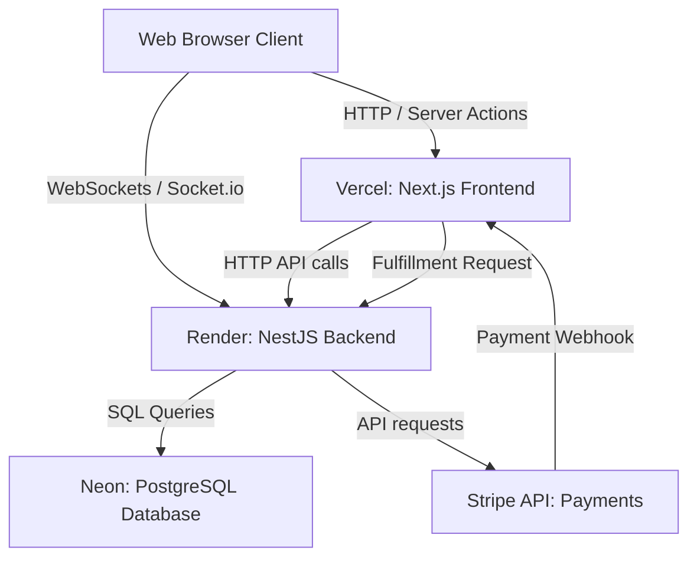

# Cloud Deployment and Operations Guide

This document outlines the architecture, setup process, operations, and maintenance guidelines for deploying the **Reverse Startup Leaderboard** project entirely in the cloud using free-tier services.

---

## 1. Cloud Architecture & Free Tier Services

We use a distributed cloud architecture optimized to run entirely on free tiers without serverless limitations on WebSockets.



### Proposed Services:
1. **Frontend Host: Vercel (Hobby Plan)**
   - **Cost:** Free ($0)
   - **Purpose:** Hosts the Next.js frontend, Server Actions, and Stripe webhook API routes.
   - **Limit:** 100 GB bandwidth/month, serverless execution limits (adequate for high traffic).
2. **Backend Host: Render (Free Web Service)**
   - **Cost:** Free ($0)
   - **Purpose:** Hosts the NestJS backend, handles REST endpoints, and maintains Socket.io WebSockets.
   - **Note on Free Tier:** The container goes to sleep after 15 minutes of inactivity. The first request after a sleep period will experience a "cold start" delay of about 50 seconds.
3. **Database Host: Neon.tech (Free Tier)**
   - **Cost:** Free ($0)
   - **Purpose:** Serverless PostgreSQL Database with Drizzle integration.
   - **Limit:** 1 Project, 10 branch databases, 0.5 GB storage (plenty for transactional leaderboard data).
4. **Payment Sandbox: Stripe (Developer Mode)**
   - **Cost:** Free ($0)
   - **Purpose:** Process mock payments for sabotage packs without real transactions.

---

## 2. Environment Variables Configuration

### Backend Environment Variables (`apps/backend/.env` on Render)

| Variable | Description | Recommended Value / Format |
|---|---|---|
| `DATABASE_URL` | Postgres Connection String from Neon | `postgresql://<user>:<password>@<neon-host>/neondb?sslmode=require` |
| `JWT_SECRET` | Secret key for JWT signing & webhook auth | A long, secure random string (e.g., `openssl rand -base64 32`) |
| `STRIPE_SECRET_KEY` | Stripe developer secret key | `sk_test_...` (Use real test key for payments, `sk_test_mock` for bypass) |
| `FRONTEND_URL` | Public URL of the frontend (Vercel) | `https://your-app.vercel.app` |
| `PORT` | Running port on the Render container | `3001` (Render will map this automatically) |

### Frontend Environment Variables (`apps/frontend/.env.local` on Vercel)

| Variable | Description | Recommended Value / Format |
|---|---|---|
| `NEXT_PUBLIC_BACKEND_URL` | Public URL of the NestJS backend | `https://your-backend.onrender.com` |
| `BACKEND_URL` | Server-side Backend endpoint URL | `https://your-backend.onrender.com` (can match the public URL) |
| `JWT_SECRET` | Webhook verification secret | Must match **exactly** the `JWT_SECRET` configured on the backend |
| `STRIPE_SECRET_KEY` | Stripe developer secret key | `sk_test_...` (Must match the backend's Stripe key) |
| `STRIPE_WEBHOOK_SECRET` | Stripe Webhook signing secret | `whsec_...` (Obtained from Stripe webhook configuration) |

---

## 3. Step-by-Step Deployment Instructions

### Step 3.1: Database Setup (Neon)
1. Sign up/Log in to [Neon.tech](https://neon.tech/).
2. Create a new project named `reverse-startup-leaderboard`.
3. Select Postgres version **15** or **16**.
4. Once created, copy the **Connection String** from the dashboard. Ensure it has `sslmode=require` at the end.
5. Keep this connection string for the migration step.

### Step 3.2: Run Database Migrations
Run the migrations from your local terminal pointing to the live Neon database before deploying the backend:
1. Export the connection string locally:
   ```bash
   export DATABASE_URL="postgresql://<user>:<password>@<neon-host>/neondb?sslmode=require"
   ```
2. Run the Drizzle migration command:
   ```bash
   pnpm --filter backend exec drizzle-kit migrate
   ```
3. Populate the initial store items and seed data:
   ```bash
   pnpm --filter backend db:seed
   ```
4. Verify the database tables (`users`, `posts`, `sabotage_packs`, etc.) are created in the Neon SQL Editor.

### Step 3.3: Backend Deployment (Render)
1. Sign up/Log in to [Render](https://render.com/).
2. Click **New** -> **Web Service**.
3. Connect your GitHub repository.
4. Configure the Web Service settings:
   - **Name:** `reverse-leaderboard-backend`
   - **Language:** `Node`
   - **Build Command:** `pnpm install && pnpm --filter backend build`
   - **Start Command:** `pnpm --filter backend start`
   - **Instance Type:** `Free`
5. Click **Advanced** and add all the environment variables listed in Section 2 for the Backend.
6. Click **Create Web Service**. Once deployed, copy the Render URL (e.g., `https://reverse-leaderboard-backend.onrender.com`).

### Step 3.4: Frontend Deployment (Vercel)
1. Sign up/Log in to [Vercel](https://vercel.com/).
2. Click **Add New** -> **Project**.
3. Import your GitHub repository.
4. Configure the build settings:
   - **Framework Preset:** `Next.js`
   - **Root Directory:** `./`
   - **Build Command:** `pnpm build`
   - **Install Command:** `pnpm install`
5. In the **Environment Variables** section, add all variables listed in Section 2 for the Frontend. Ensure `NEXT_PUBLIC_BACKEND_URL` points to your Render backend URL.
6. Click **Deploy**. Vercel will build the frontend monorepo app and generate a live URL (e.g., `https://reverse-leaderboard.vercel.app`).

### Step 3.5: Stripe Webhook Setup
If using real Stripe test/live credentials instead of Mock Mode:
1. Go to the [Stripe Dashboard](https://dashboard.stripe.com/) -> **Developers** -> **Webhooks**.
2. Click **Add Endpoint**.
3. Set the Endpoint URL to: `https://your-app.vercel.app/api/webhooks/stripe`.
4. Select the event to listen to: `checkout.session.completed`.
5. Copy the **Signing Secret** (`whsec_...`).
6. Update your Vercel project environment variables by adding `STRIPE_WEBHOOK_SECRET` with this value, and redeploy the frontend.

---

## 4. Operation and Maintenance (O&M)

Since we are running on free tiers, proactive maintenance is required to ensure smooth operations.

### 4.1 Overcoming Render Cold Starts
Render's free tier spins down the service after 15 minutes of inactivity. To prevent users from waiting 50+ seconds for the backend to wake up:
- **Solution:** Use a free uptime monitoring tool like [UptimeRobot](https://uptimerobot.com/) or [cron-job.org](https://cron-job.org/).
- **Configuration:** Set up an HTTP monitor pinging the backend server status endpoint every 10–14 minutes:
  - Target URL: `https://your-backend.onrender.com/` (or the default health/root check).
- **Result:** Keeps the Render container active and eliminates cold starts.

### 4.2 Database Backup (Neon)
Neon provides automatic point-in-time recovery and automated backups for free-tier projects, but it's recommended to take manual snapshots before major updates.
- **Manual Backup Script:** Run this command locally or via GitHub actions to back up the schema and data:
  ```bash
  pg_dump "$DATABASE_URL" -F c -b -v -f backup_$(date +%F).dump
  ```
- **Recovery:**
  ```bash
  pg_restore -d "$DATABASE_URL" -v backup_xxx.dump
  ```

### 4.3 Log Management
Since free hosts do not persist logs indefinitely:
1. **Render Logs:** Render only stores the last 1000 lines of console output. Monitor them in the Render Dashboard -> Logs.
2. **Vercel Logs:** Vercel Runtime Logs are available on the deployments dashboard.
3. **Audit Trail:** Check the `purchases` and `user_sabotages` database tables periodically to verify transactions.

### 4.4 Security Rotation & Maintenance
1. **JWT Rotation:**
   - **Frequency:** Every 90 days.
   - **Action:** Change `JWT_SECRET` in both Vercel and Render dashboards.
   - **Impact:** Force-logs out all active users.
2. **Postgres Storage Check:**
   - **Limit:** Neon free tier is capped at 500 MB.
   - **Action:** Periodically clean old posts or comments if they exceed limits. Keep a check on row counts in the `posts` and `comments` tables.

### 4.5 NestJS Production Memory Optimization (OOM Avoidance)
Render's free tier provides 512 MB of RAM. Running `nest start` directly compiles TypeScript on-the-fly or wraps execution in Nest CLI processes, which easily triggers a `JavaScript heap out of memory` crash during initialization.
- **Solution:** We configured the `"start"` script in the backend's [package.json](file:///Users/loct-581/Work/reverse-startup-leaderboard/apps/backend/package.json) to directly launch the compiled production bundle: `"start": "node dist/src/main.js"`.
- **Result:** This drops the start-up RAM usage from >300 MB to around ~60 MB, allowing the backend to start and run stably on Render's free tier.

